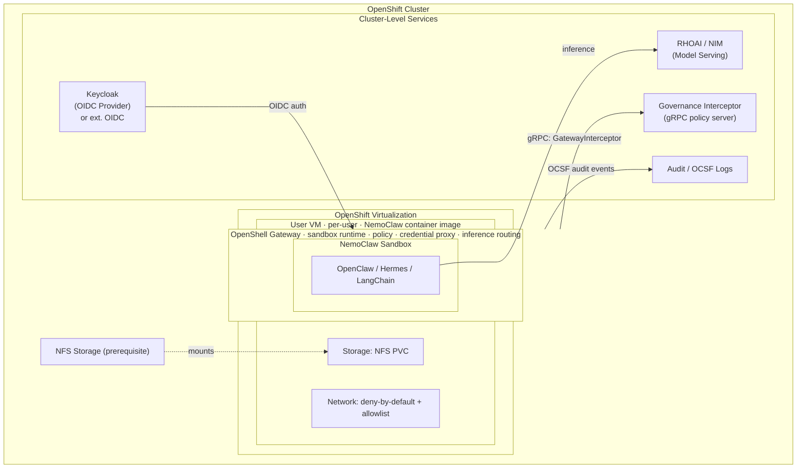

# Secured Agent Workspace (SAW) Quickstart

**Repo:** [rh-ai-quickstart/secured-agent-workspace](https://github.com/rh-ai-quickstart/secured-agent-workspace)
**Status:** Discovery
**Date:** 2026-07-23

## Use case summary

Deploy a Secured Agent Workspace (SAW) on Red Hat OpenShift using OpenShift Virtualization, following NVIDIA's reference architecture. Users authenticated as admins in Keycloak can request a VM. Each user gets a dedicated VM provisioned by OpenShift Virtualization with OpenShell deployed inside the VM as the sandbox runtime. Users then use the NemoClaw CLI (`$$nemoclaw onboard`) to create OpenClaw sandboxes governed by that VM-local OpenShell instance. Autonomous AI agents execute within infrastructure-level security boundaries — not prompt-level controls.

The quickstart takes a user from a bare OpenShift cluster (with or without OpenShift Virtualization pre-installed) to a running, governed agent workspace in under 30 minutes, following one document, making zero architecture decisions.

## User flows

### Golden path (Phase I)

```
1. Prerequisite check
   └─ Single command verifies cluster readiness:
      OpenShift Virtualization, storage, GPU (if applicable)
      Reports exactly what is missing

2. Install platform services
   └─ Single Helm install / apply brings up cluster-level services:
      - OpenShift Virtualization Operator (if not present, given admin permissions)
      - Keycloak (OIDC provider — default; or connect to external OIDC)
      - RHOAI / NIM inference endpoint
      - Network policies (deny-by-default egress + starter allowlist)

3. Request workspace (Keycloak admin required)
   └─ User authenticates via Keycloak:
      - If user has admin role in Keycloak → VM request is authorized
      - Provisions a single-tenant Linux VM via OpenShift Virtualization
        using the NemoClaw container image (built from upstream Dockerfile —
        OpenClaw default agent, OpenShell sandbox, NemoClaw CLI pre-installed)
      - OpenShell gateway starts automatically with the VM
      - Inference routing configured to on-cluster NIM (RHOAI)

4. Create agent sandbox (inside VM)
   └─ OpenShell gateway is already running in the VM (provisioned at VM creation).
      User runs NemoClaw CLI to create a sandbox on top of it:
      $ $$nemoclaw onboard
      - Detects the existing OpenShell gateway
      - Registers inference providers (routed to cluster NIM)
      - Builds hardened sandbox image
      - Creates OpenClaw sandbox governed by OpenShell
      - Applies default policy bundle (egress rules, tool permissions, credential proxy)
      All defaults opinionated; all overridable later

5. Attach
   └─ User connects to the working agent (OpenClaw by default)
      via OpenClaw dashboard, terminal, or IDE

6. Teardown
   └─ Full cleanup: sandbox → VM → no orphans, re-runnable
```

### Alternative agent runtimes

OpenClaw is the default agent. Users can swap in:
- **Hermes** — set `NEMOCLAW_AGENT=hermes` before install
- **LangChain Deep Agents Code** — set `NEMOCLAW_AGENT=langchain`

### Subagent configuration flow

```
1. User defines subagent policies (tool access, egress scope, duration)
2. Configure API keys via credential proxy (no static secrets in the VM)
3. Register tools via governed connector layer
```

## Data model

| Entity | Storage | Notes |
|--------|---------|-------|
| VM image | OpenShift Virtualization (KubeVirt) | Built from upstream [NemoClaw Dockerfile](https://github.com/NVIDIA/NemoClaw/blob/main/Dockerfile) — OpenClaw as default agent, OpenShell sandbox, NemoClaw plugin; base image from `ghcr.io/nvidia/nemoclaw/sandbox-base:latest` |
| Workspace state | NFS-backed PVC per user | Persistent across sessions; considered ephemeral vs enterprise systems |
| Policy bundles | NFS read-only mount | Immutable release directories, atomic pointer advancement |
| Audit trail | OCSF-compatible log sink | Workspace lifecycle, broker sessions, tool events |
| Credentials | OpenShell credential proxy (in VM) | Never stored inside agent process; managed by VM-local OpenShell |
| Agent config | ConfigMap (bootstrap only) | Policy channel, release version, bundle path, hash, signature ref |

### Identity model (four layers)

| Layer | Identity type | Purpose |
|-------|--------------|---------|
| Sponsor | Enterprise SSO | Human who initiates and is accountable |
| Workspace | Attested device identity | The VM compute environment |
| Agent | Logical registration | Registered with lifecycle state, linked to sponsor |
| Tool call | Short-lived runtime-attested credential | Per-invocation credential for each tool access |

Every action resolves back through all four layers to the sponsor before tool access is granted.

## AI touchpoints

| Touchpoint | Technology | Where | Description |
|------------|-----------|-------|-------------|
| Agent runtime | NemoClaw (OpenClaw / Hermes / LangChain) | In VM | Agent execution inside per-user VM |
| Sandbox runtime | OpenShell | Inside each VM | Sandboxing, policy enforcement, credential proxy — one instance per VM |
| Identity / SSO | Keycloak (default) or external OIDC | Cluster-level service | OIDC provider for workspace access and VM authorization |
| Inference | NVIDIA NIM on OpenShift AI (RHOAI) | Cluster-level service | On-cluster NIM model serving; inference is a dependency, not a workspace feature |
| Tool execution | Governed connector layer via OpenShell | Inside VM | Agent tool calls routed through VM-local OpenShell credential proxy |
| Policy enforcement | OpenShell runtime policies | Inside VM | Deny-by-default egress, filesystem/process scoping, capability drops |

### Agent capabilities

- Agentic coding (primary use case for Phase I)
- Document/knowledge work
- Tool-augmented workflows with governed access to enterprise systems (Git, ticketing, docs, chat, data stores)

## Deploy target

### Primary: Red Hat OpenShift with OpenShift Virtualization

Follows the [NVIDIA OpenShift Virtualization Reference Implementation](https://docs.nvidia.com/enterprise-reference-architectures/secure-agent-workspace-reference-design/latest/openshift-virtualization-reference-implementation.html).

**Reference shape:**
- OpenShift 4.22+ with OpenShift Virtualization operator
- Keycloak (OIDC provider for workspace access; or external OIDC)
- Red Hat OpenShift AI (RHOAI) with NVIDIA NIM for model serving
- OpenShift GitOps / Argo CD for policy management
- NFS-backed shared storage
- One persistent Linux VM per user running OpenShell + NemoClaw (from NemoClaw container image)

**Deployment tier:** CPU VM (Tier 1) on golden path — inference served by on-cluster NIM via RHOAI. GPU VM (Tier 2) optional for local inference, accelerated tooling, and GPU-accelerated agent workloads inside the VM.

### Cluster prerequisites

| Component | Required | Notes |
|-----------|----------|-------|
| OpenShift | 4.22+ | Base platform |
| OpenShift Virtualization | Yes | Prereq check installs if missing (admin perms required) |
| OpenShift AI (RHOAI) | Yes | On-cluster NIM model serving for agent inference |
| NFS storage | Yes (prerequisite) | Must exist before install; workspace persistence + policy bundles |
| Red Hat SSO / Keycloak | Default | Deployed on-cluster; configurable to external OIDC provider |

## SAW Phase I conformance (control objectives)

The quickstart implements all seven Phase I managed VM controls:

| # | Control | Implementation |
|---|---------|---------------|
| 1 | One VM per user | OpenShift Virtualization — no shared agent process space |
| 2 | Approved VM images only | Built from upstream NemoClaw Dockerfile (OpenClaw default + OpenShell); versioned, signed |
| 3 | Workspace lifecycle via portal/API | Helm/Makefile-driven lifecycle (create/start/stop/teardown) |
| 4 | SSO-backed access broker | Keycloak (default) or external OIDC with short-lived, auditable sessions |
| 5 | Default-deny network egress | NetworkPolicy + EgressFirewall + starter allowlist |
| 6 | GitOps-managed policy | ArgoCD reconciles VM profiles, network policy, platform config |
| 7 | Centralized audit | OCSF-mapped workspace lifecycle and access audit |

## Architecture overview



### Policy governance via gRPC

The OpenShell gateway inside each VM connects to an external **Governance Interceptor** — a gRPC service implementing `openshell.gateway_interceptor.v1.GatewayInterceptor` ([proto](https://github.com/NVIDIA/OpenShell/blob/main/proto/gateway_interceptor.proto)). This service runs at the cluster level and governs all VMs.

**Gateway interceptor capabilities:**
- **`modify_operation`** — apply signed policy to every new sandbox via `CreateSandbox`
- **`validate`** — reject policy changes (`UpdateConfig`) that violate organizational rules; reject unauthorized provider changes
- **`post_commit`** — observe committed operations for audit/inventory

**Configuration** (in each VM's `gateway.toml`):

```toml
[[openshell.gateway.interceptors]]
name               = "policy-governance"
grpc_endpoint      = "http://<cluster-governance-service>:18081"
order              = 10
failure_policy     = "fail_closed"
binding_policy     = "allowlist"

[[openshell.gateway.interceptors.bindings]]
rpc    = "openshell.v1.OpenShell/CreateSandbox"
phases = ["modify_operation", "validate"]

[[openshell.gateway.interceptors.bindings]]
rpc    = "openshell.v1.OpenShell/UpdateConfig"
phases = ["validate"]
```

**OIDC integration** (in each VM's `gateway.toml`):

```toml
[openshell.gateway.oidc]
issuer        = "https://<keycloak>/realms/openshell"
audience      = "openshell-cli"
roles_claim   = "realm_access.roles"
admin_role    = "openshell-admin"
user_role     = "openshell-user"
```

Additionally, **Supervisor Middleware** provides runtime HTTP request filtering via gRPC — content guards, credential redaction, and per-request policy enforcement inside the sandbox.

### Reference diagram (text)

```
┌──────────────────────────────────────────────────────────----───┐
│                     OpenShift Cluster                           │
│                                                                 │
│  ┌──────────── Cluster-Level Services ─────────────────┐        │
│  │                                                     │        │
│  │  ┌───────────-──┐  ┌─────────────┐  ┌─────────────┐ │        │
│  │  │  Keycloak    │  │  RHOAI /    │  │  Governance │ │        │
│  │  │  (OIDC       │  │  NIM        │  │  Interceptor│ │        │
│  │  │   Provider)  │  │  (Model     │  │  (gRPC      │ │        │
│  │  │  or ext.     │  │   Serving)  │  │   Policy    │ │        │
│  │  │  OIDC        │  │             │  │   Server)   │ │        │
│  │  └──────┬───────┘  └──────▲──────┘  └─────────────┘ │        │
│  └─────────│─────────────────│─────────────────────────┘        │
│            │ auth            │ inference                        │
│  ┌─────────│─── OpenShift Virtualization ──│───────────----───┐ │
│  │         │                               │                  │ │
│  │  ┌──────▼───────────────────────────────┴──────--───────┐  │ │
│  │  │              User VM (per-user)                      │  │ │
│  │  │         (NemoClaw container image)                   │  │ │
│  │  │                                                      │  │ │
│  │  │  ┌────────────────────────────────────────────────┐  │  │ │
│  │  │  │  OpenShell (sandbox runtime, policy,           │  │  │ │
│  │  │  │           credential proxy, inference routing) │  │  │ │
│  │  │  │                                                │  │  │ │
│  │  │  │  ┌──────────────────────────────────────────┐  │  │  │ │
│  │  │  │  │  NemoClaw sandbox                        │  │  │  │ │
│  │  │  │  │  ┌─────────────────┐                     │  │  │  │ │
│  │  │  │  │  │ OpenClaw /      │  (default agent)    │  │  │  │ │
│  │  │  │  │  │ Hermes /        │                     │  │  │  │ │
│  │  │  │  │  │ LangChain       │                     │  │  │  │ │
│  │  │  │  │  └─────────────────┘                     │  │  │  │ │
│  │  │  │  └──────────────────────────────────────────┘  │  │  │ │
│  │  │  └────────────────────────────────────────────────┘  │  │ │
│  │  │                                                      │  │ │
│  │  │  Network: deny-by-default + allowlist                │  │ │
│  │  │  Storage: NFS PVC (workspace + policy)               │  │ │
│  │  └──────────────────────────────────────────────────────┘  │ │
│  └────────────────────────────────────────────────────────────┘ │
│                                                                 │
│  ┌──────────────┐                                               │
│  │  NFS Storage │  (prerequisite)                               │
│  └──────────────┘                                               │
└───────────────────────────────────────────────────----──────────┘
```

## Key references

- [NVIDIA SAW Reference Design](https://docs.nvidia.com/enterprise-reference-architectures/secure-agent-workspace-reference-design/latest/what-is-secure-agent-workspace.html)
- [OpenShift Virtualization Reference Implementation](https://docs.nvidia.com/enterprise-reference-architectures/secure-agent-workspace-reference-design/latest/openshift-virtualization-reference-implementation.html)
- [NemoClaw GitHub](https://github.com/NVIDIA/NemoClaw/tree/main)
- [OpenShell GitHub](https://github.com/NVIDIA/OpenShell)
- [OpenShift Virtualization 4.22 Install Guide](https://docs.redhat.com/en/documentation/openshift_container_platform/4.22/html/virtualization/installing)
