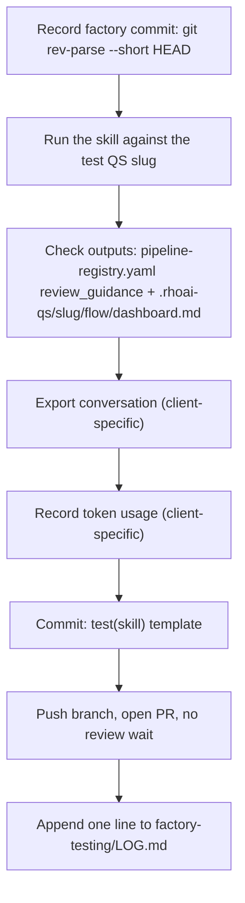

# Skill Testing & Training Guide

How we (mtalvi + Yossi) validate and train Quickstart Factory skills as the factory evolves, by driving a real "test" AI Quickstart through the greenfield pipeline and recording evidence for every skill run.

## 1. Purpose & Scope

As skills under `core/skills/` change, we need a repeatable way to prove a skill still works — not just read the diff and hope. The approach: run the skill for real, against a disposable-but-tracked test quickstart, and keep a record (conversation + token usage + commit) for every run.

- **Ownership:** the test quickstart's own repo is **private, under one of our personal GitHub accounts** (mtalvi's or Yossi's) — **not** under the `rh-ai-quickstart` org. Access is limited to the two of us.
- **One long-lived slug**, not a fresh one per cycle. The commit template below uses a `(test)` suffix on the quickstart name because we expect to run the same test quickstart through the same skills over and over as the factory changes — test history accumulates as commits over time. Only reset the slug if a clean re-run is deliberately useful (e.g. a major pipeline restructuring).
- **In scope:** `rh-qs-discovery` → `rh-qs-architect` (+ `rh-qs-secure`) → `rh-qs-scaffold` → `rh-qs-implement` → `rh-qs-verify-build` → `rh-qs-deploy` → `rh-qs-test-suite` → `rh-qs-verify-deploy` → `rh-qs-document`. Backlog-management skills (`gh-backlog-reader`, `pipeline-grooming`, etc.) can also be exercised this way if we want to test a change to one of them.
- **Out of scope for now:** `rh-qs-ship`. See [§6](#6-out-of-scope-rh-qs-ship) for why, and how we'd extend this later if we change our minds.

## 2. How the Test Quickstart Is Set Up

The test quickstart is not special-cased — it goes through the exact same convention as any real quickstart, because that's what makes the test meaningful:

- It lives under `.rhoai-qs/<slug>/` inside our local `quickstart-factory` checkout, per [pipeline-convention.md](foundation/pipeline-convention.md). Every skill still resolves the slug via the `validation-skill` subagent (Phase 0) before touching any files, exactly as it would for a real quickstart.
- Starting at `rh-qs-scaffold`, `.rhoai-qs/<slug>/` becomes the working directory of a real, separate git repository (via `git init`, not `git clone` — see pipeline-convention.md). **The one manual override from normal usage:** point `rh-qs-scaffold`'s `gh repo create` step at our personal private repo instead of the `rh-ai-quickstart/<slug>` default.
- `.rhoai-qs/` is gitignored inside `quickstart-factory` itself (see [.gitignore](../.gitignore), the `.rhoai-qs/` rule). That means none of our test evidence can live in `quickstart-factory`'s own git history — it all has to be committed **inside the nested test-quickstart repo**, under a new tracked folder:

  ```
  <test-quickstart-repo>/
    factory-testing/
      <skill-name>/
        <yyyy-mm-dd>-<factory-short-hash>.md   ← exported conversation
        <yyyy-mm-dd>-<factory-short-hash>-tokens.md  ← token usage record
      LOG.md   ← one line per test run, across all skills (see §3)
  ```

## 3. Per-Skill Test Loop

This is the repeatable checklist for testing one skill, one time:



1. **Record the factory commit.** In `quickstart-factory`, run `git rev-parse --short HEAD`. This is the `Factory:` value in the commit message (§4).
2. **Run the skill** against the test quickstart's slug, in whichever client we're using (Cursor or Claude Code).
3. **Check the outputs — reuse, don't reinvent.** Every pipeline skill already has an `expected_outputs` list and a `review_guidance` block in [core/flow/pipeline-registry.yaml](../core/flow/pipeline-registry.yaml), and skills already call [core/flow/pipeline-checkpoint.py](../core/flow/pipeline-checkpoint.py) to update `.rhoai-qs/<slug>/flow/dashboard.md` after they run. Look there first:
   - Did the dashboard mark the skill `done` with `outputs_verified: true`?
   - Does the skill's `review_guidance` in `pipeline-registry.yaml` hold up (file exists, `make lint`/`make test` pass, no placeholders, etc.)?
   - Only write a manual note in the commit if something looks off — don't invent a second, parallel definition of "done." This mirrors the same reuse-first pattern the factory already uses for [acceptance-criteria.md](foundation/acceptance-criteria.md).
4. **Export the conversation** — see §4 for the client-specific method.
5. **Record token usage**, including subagents, and confirm no single agent exceeded ~100K tokens — see §4. If it did, don't just log it and move on — fix it:
   - **Exceeded by a lot** → treat this as a real defect in the skill, not a footnote. Dig into why (e.g. it's reading files a subagent should be handling, pulling in reference docs it doesn't need, loading a subagent prompt into the main agent's own context instead of passing it by file path — see the context-saving rule in [skill-directory-structure.md](foundation/skill-directory-structure.md)). Fix the skill, then re-run the test before committing.
   - **Exceeded by a little** → carefully review the run for obvious waste (redundant reads, verbose subagent output flowing back into the main context, etc.) and see if the number can be brought down. Still commit either way, with a note on what was found and whether it was fixed or is being tracked for a follow-up pass.
6. **Commit** using the template in §5, on a branch named `test/<skill>-<yyyymmdd>`.
7. **Push and open a PR** against the test repo's own `main`. No need to wait for review, but write a clear description (see §5).
8. **Append one line to `factory-testing/LOG.md`** in the test repo: skill, date, factory short hash, pass/fail, token total (or `N/A` — see §4).

## 4. Client-Specific Instructions: Cursor vs. Claude Code

Our two guardrails — "export the conversation" and "record token usage" — work very differently depending on the client. This is the part that's easy to get wrong, so it's spelled out explicitly.

### Claude Code

Both guardrails are natively supported:

- **Export:** run `/export <filename>` at the end of the session. It writes the conversation directly to that file — use `factory-testing/<skill>/<date>-<hash>.md` as the filename.
- **Token usage:** run `/cost` (alias for `/usage`). It shows session token/dollar totals and, on Pro/Max/Team/Enterprise plans, **a breakdown by subagent** — exactly what's needed to confirm no single agent (including subagents) went over ~100K tokens. Copy that breakdown into `factory-testing/<skill>/<date>-<hash>-tokens.md`.

### Cursor

Neither guardrail has a direct, documented equivalent in Cursor today. Use these best-effort substitutes instead of skipping the guardrail:

- **Export:** Cursor's IDE "Export Transcript" action (right-click the chat tab) exists but is undocumented and **drops tool calls and subagent conversations** — not sufficient for our purposes. Instead, use the raw transcripts Cursor already writes to disk for every session:
  - Main conversation: `~/.cursor/projects/<workspace-slug>/agent-transcripts/<session-uuid>.jsonl`
  - Any subagents it spawned: `~/.cursor/projects/<workspace-slug>/agent-transcripts/<session-uuid>/subagents/<subagent-uuid>.jsonl`

  Copy (don't move) the relevant file(s) into `factory-testing/<skill>/<date>-<hash>.md` (rename `.jsonl` → `.md` is fine, or keep as `.jsonl` if we want to preserve structure — either way, treat this as an unsupported-but-workable format, not an officially guaranteed one).

- **Token usage:** there is **no reliable per-conversation token count** in Cursor's IDE or CLI today. The only authoritative source is the Team/Enterprise Admin API (`GET /teams/filtered-usage-events`, joined on `conversationId`), which requires an admin key we don't have for a personal test setup. **Do not guess a number.** Log:

  ```
  N/A (Cursor — no token API access)
  ```

  If we want a rough sense of scale, an optional estimate is transcript character count ÷ 4 ≈ tokens — but label it clearly as an approximation, never as the real figure.

- **Practical consequence:** the "~100K tokens per agent" ceiling is **enforceable in Claude Code today**, but only **best-effort / unverifiable in Cursor** until Cursor ships real per-session usage reporting. State this plainly in `LOG.md` entries (e.g. `tokens: N/A`) rather than implying false precision.

## 5. Commit & PR Guardrails

The commit template matches the `type(scope):` convention already used in this repo's history (e.g. `feat(flow):`, `kb(extract):`, `ci:`), so `test(<skill>):` fits naturally — no changes needed there.

**Commit template:**

```
test(<skill>):
QS: <quickstart_name> (test)
Factory: <short_hash>
<client>: <model>
<optional comment>
```

`<client>: <model>` records which AI client and model ran the session (e.g. `Claude: Opus 4.6 (1M context)` or `Cursor: <model>`). This matters because model choice affects the two client-specific guardrails in §4 — a model swap is often the real explanation when a skill's behavior changes between two test runs, not the skill itself.

**Recommended default:** Claude Opus 4.6 with the 1M context window, for Claude Code test runs. The larger context window matters here specifically because pipeline sessions (e.g. `rh-qs-implement`, `rh-qs-deploy`) can run long with multiple subagents — 1M context reduces the risk of auto-compaction losing context mid-run and confounding the test. Use whatever the Cursor-side equivalent is when testing from Cursor, and still record it.

**Example:**

```
test(rh-qs-architect):
QS: customer-support (test)
Factory: 7da561b
Claude: Opus 4.6 (1M context)
Spec validation passed, diagram generated correctly
```

**Branch naming:** `test/<skill>-<yyyymmdd>` (e.g. `test/rh-qs-architect-20260819`).

**PRs:**
- Open against the test repo's own `main`. No need to wait for review before merging.
- Still write a clear description — what skill was tested, what changed since the last time it was tested, and a link to that run's `factory-testing/<skill>/...` files (conversation export + token log).

## 6. Out of Scope: `rh-qs-ship`

`rh-qs-ship` creates a real pull request and blog draft, and can touch the public `ai-quickstart-contrib` backlog — none of that is appropriate for an internal test quickstart, so it's excluded from the test loop for now.

If we want to bring it into scope later, the smallest change would be pointing `rh-qs-ship` at the test repo itself (PR against its own `main`) instead of the public backlog, and skipping the blog-draft/backlog-update steps entirely. Revisit this if/when we're actively iterating on `rh-qs-ship` itself.

## 7. Summary of Gaps Filled In

Filling in a few things the original guardrail list didn't cover yet:

- **No defined pass/fail bar** → reuse `pipeline-registry.yaml`'s `review_guidance` and the `dashboard.md` the factory already produces (§3), instead of inventing new criteria.
- **No home for exported conversations/token logs** → `factory-testing/<skill>/` inside the test repo, since `quickstart-factory`'s own `.rhoai-qs/` is gitignored (§2).
- **No rolling view across many test cycles** → `factory-testing/LOG.md`, one line per test run (§2, §3).
- **No defined action when the ~100K token ceiling is breached** → don't just log it: fix the skill if the overage is large, or review and try to lower it if the overage is small (§3 step 5, updated per PR review feedback from Yossi).
- **No Cursor/Claude parity note** → §4.
- **`rh-qs-ship` scope boundary was implicit** → made explicit, with a note on how to extend it later (§6).
- **No record of which client/model ran a given test** → added a `<client>: <model>` line to the commit template, with Claude Opus 4.6 (1M context) as the recommended default (§5, added per PR review feedback from Yossi).

## Follow-Up (Not Yet Done)

Consider adding a one-line pointer to this guide from root [AGENTS.md](../AGENTS.md) or [core/AGENTS.md](../core/AGENTS.md) so other contributors discover it exists. Left out for now — revisit if others start contributing to skills.
